# 一、项目介绍 [冯子豪、胡振宇]

## 背景

就业帮，是一款HR能够快速发布招聘信息的来招募到所需的人才的招聘软件；更是一款有着众多各色推荐，能为在杭大学生求职者找到满意的工作的软件，是一款发布、招聘于一体的软件。在这里你可以与面试者、应聘者面对面交流，查看各种各样的工作信息。

## 项目需求分析

我们将就业帮的功能分为四个大块，分别是**用户管理、消息聊天、岗位招聘、信息发布**。

**用户管理：**获取微信账号信息的头像、昵称信息和openID作为数据库中的userID。

**消息聊天：**当用户申请工作时，就会在创建应聘者与面试者之间的聊天。应聘者可以在聊天之后选择是否接受应聘者的请求，当面试者做出了决定，应聘者也能查看结果。

**岗位招聘：**可以通过多种多样的筛选和搜索来快速找到自己心仪的工作。

**信息发布：**可以发布自己想要招聘的工作来吸引人才。

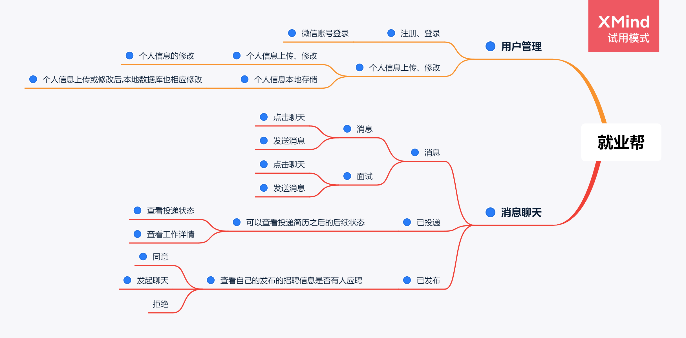

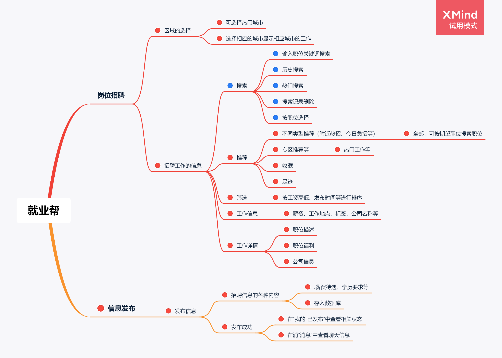

## 计划和分工

我们按照前、后端两个大块进行分工。

前端负责人：冯子豪

主要工作：1、前端所有页面设计、实现、优化

​					2、前端所有页面逻辑实现

​					3、所有前后端集成

​					4、系统测试

​					5、前三次PPT、文档的攥写

​					6、视频录制

后端负责人：胡振宇

主要工作：1、后端所有接口设计、实现

​					2、后端数据库设计

​					3、前后端接口联调

​					4、后端系统测试

​					5、后端系统部署

​					6、文档撰写

# 二、界面原型设计 [冯子豪]

**用户管理：**

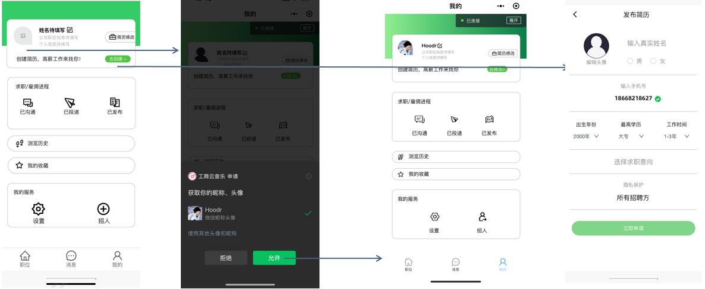

页面的跳转关系，如图中箭头所示。用户没有登陆时，类似于图1中，头像和名字是默认的，用户授权登录之后就可以快速显示头像和昵称。简历的页面，采用了大量的选择器表单项，可以方便的让用户填写信息。

这样设计没有了传统的登录、注册等页面，使得登录功能变得简洁。同时显示的只有头像和昵称，并且简历需要单独设置，这样使得页面看起来跟为简约，因为就业帮小程序的主要功能点并不在用户的管理。

优点：1.用户不需要额外的注册，没有传统的登录、注册页面。

​			2.简历的填写过程十分方便。

​			3.我的页面外观上简约。

缺点：1.色彩和布局比较单调和空旷。

实现难度上来讲，并不算困难。

**消息聊天：**    

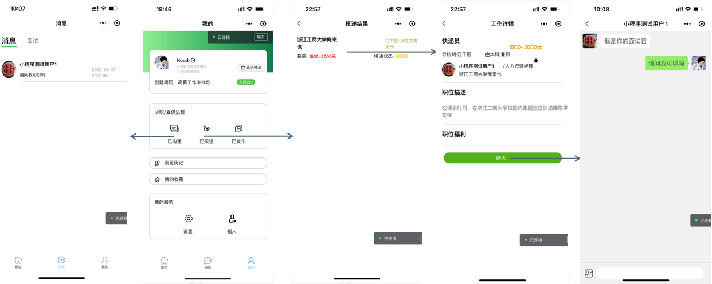

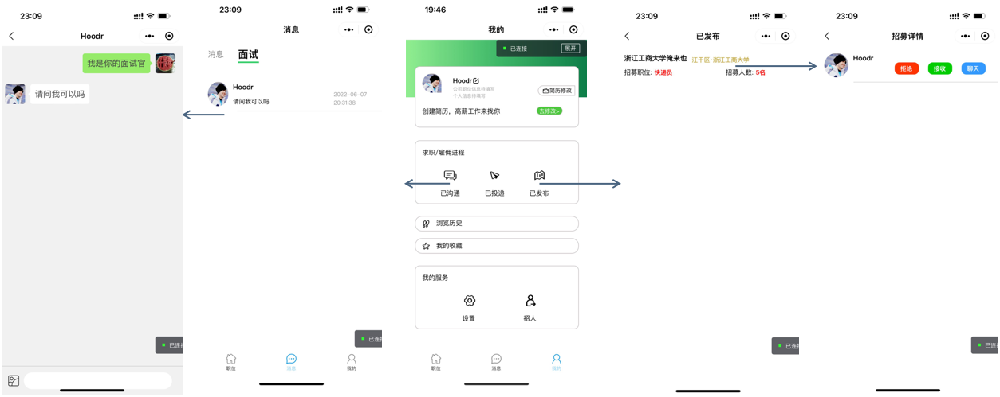


页面的跳转关系，如图中箭头所示。消息列表分为两个标签页，消息和面试，选中会加大加粗，并添加下划线，两个标签页显示不同的内容。这部分之所以使用了多个不同的页面，是因为消息聊天是我们小程序的重点之一，再找到心仪的工作之后，需要进行聊天、是否接受等一系列的后续操作来保证申请工作的一个完整的流程。所以设计了许多界面来满足这部分的功能。这样设计也在于条理清晰，方便用户的操作。不同的用户关注也不同，如应聘者可能更关注薪资，所以在已投递中显示工资等有关的信息。

优点：1.页面数量多，但条理清晰，用户有更好的体验。

​			2.同一页面通过标签页进行复用，方便即是发布者、申请者的使用。

​			3.过程清晰明了，使得整个过程，第一次使用的人也能快速上手。

缺点：1.页面比较简单，以白色背景为主。

​			2.没有列表等数据时没有提示。

因为页面数量较多，增加了一定的工作量，也增加了后续集成的难度。

**岗位招聘**：

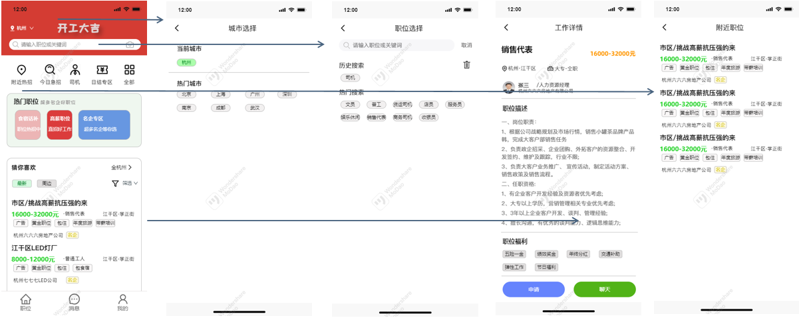

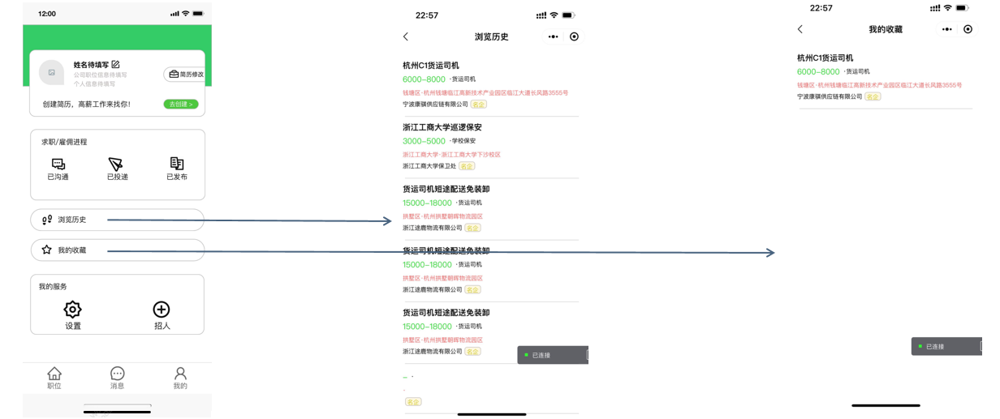

页面的跳转关系，如图中箭头所示之外，还有许多的跳转由于类似就没有全部列举，大部分都是查询的跳转。

主页多个查询，都有对应相关联的图标，或者相应的文字说明，符合主题，采用滑动来查看多个工作，能够保持高度，提高美观程度，工作有不同的标签，和尽可能详细的信息，来提高用户体验。位置页面的设计由于我们限定再杭州地区，于是选择直观的点击选择。搜索页面设计了历史搜索等都是采用气泡包裹的方式，这样显得每条搜索记录独立，美观。工作详情页面有着充分的信息，且标注明确，可以让用户一目了然的了解工作信息。历史和收藏功能的实现，若收藏了这个工作，当你点击进入时会点亮工作详情页面的五角星，直观，足迹的加入，也能方便用户第一时间重新找到感兴趣的工作。

优点：1.不同类型的查询有不同的相应图标或文字说明。

​			2.气泡包裹文字的形式，美观、独立，且便于用户选择。

​			3.工作详情，信息明确，充足。

​			4.收藏的小星星亮灭使得用户有交互感。

缺点：1.用户感觉重复感高，因为多个查询页面样式一致。

工作量大，为后续的集成带来了更多的工作量。

**信息发布**：

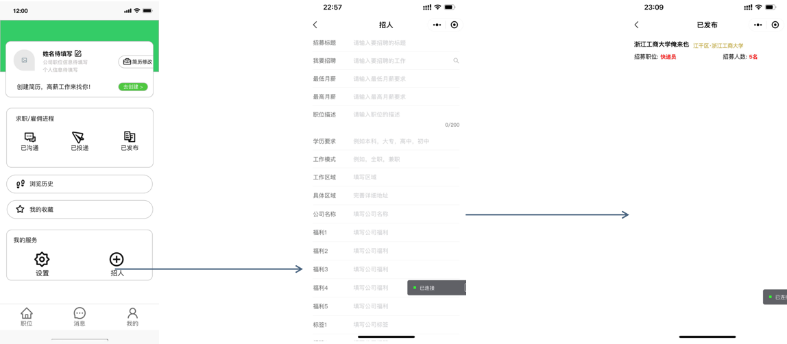

主要采用了大量的表单项来完成这个页面的设计。

优点：1.用户可以一次性填写完成。

缺点：1.填写信息过多。

​			2.信息要求的格式可能不统一。

这部分工作量较小。


# 三、系统架构设计 [冯子豪、胡振宇]

## 前端系统架构

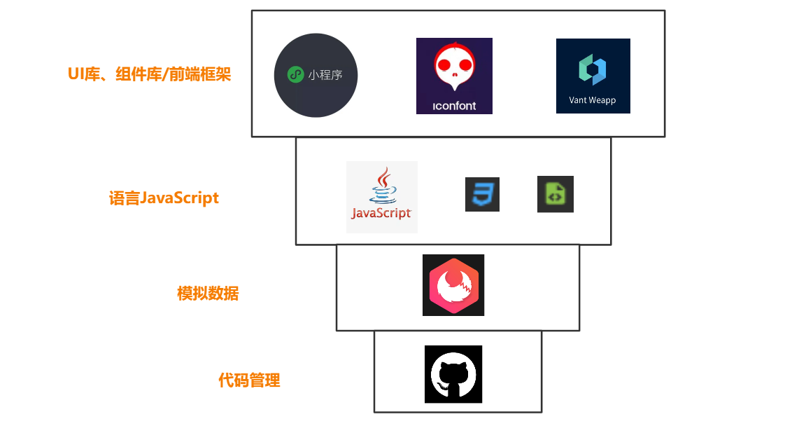

**UI库、组件库/前端架构**：

1、UI图标库(iconfont)：为我的小程序提供了所有的UI图标。

作用：利用wxss代码来远程调用图标库，因为小程序对于程序的大小比较敏感，所以在设计时能不适用本地图片或者ui时尽量不适用，这样的好处在于，不用将图标下载到本地，节省小程序的体积。

缺点：UI图标依赖于一个库，可能会出现想要的图标没有的情况。


2、组件库(vant-weapp)：为我的小程序部分页面提高了现成的组件，主要是一些表单项和选择器。

作用：可以利用组件库，方便的快速的实现某些我需要的功能，比如一个输入框或者一个搜索框等等，提高了页面制作的速度。

缺点：功能比较死板，组件的颜值也不算高，而且小程序版本过新会导致显示失败。


3.原生小程序框架：小程序页面制作的主要框架。

作用：页面的制作，功能的实现等

缺点：实现不如组件库简单、快速。

**语言**：

1、JavaScript：前端逻辑的编写语言。

作用：实现小程序的各种各样的功能，调试任务。


2、wxss、wxml：前端页面的设计文件。

作用：让小程序的页面变得美观，配合JS实现各种各样的功能。

**模拟数据：**

1、APIFox：前期利用APIFox的MOCK功能来模拟数据，以便可以及时的进行前后端的集成工作。后期后端搭建完成之后，也能切换正式环境，来方便的完成集成、测试等一系列的工作。

作用：前期提高模拟的数据，能够不依赖于后端的进度来完成集成，后期能够快速切换正式环境，来完成集成。

**代码管理：**

1、github：代码的管理，文档、ppt的上传等。

作用：能够管理代码，以防代码丢失。


### 模块功能及实现

前端按功能分为四个模块：**用户管理、聊天消息、岗位招聘、信息发布**。

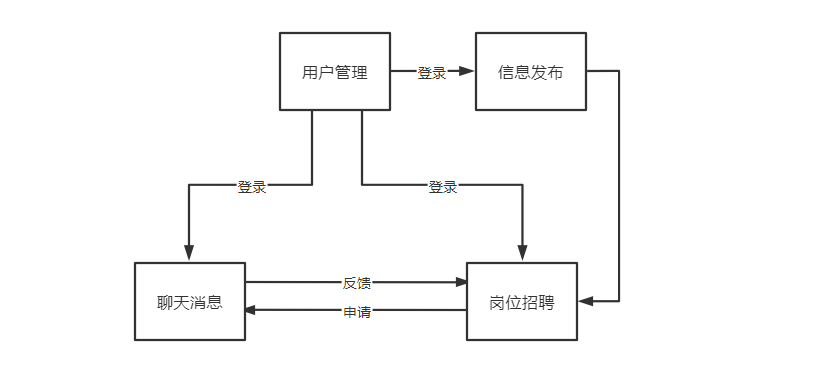

这是四者之间的联系图。只有在用户登录之后，才能进行申请，聊天，查看投递状态等一系列信息。未登录状态只能看看工作。


**用户管理：**

就业帮小程序是不需要用户注册信息的，因为是微信小程序，每个用户都有微信账号，可以利用已有的微信账号进行授权登录，省去了注册账号的麻烦，并且后续也不会有忘记密码等的烦恼。

优点：1.用户不需要额外的注册，也体现了小程序随时随用的便捷之处。

​            2.微信用户的唯一标识符openID可用来作为userID。

缺点：1.授权获得的用户信息对于本小程序来说不全，需要额外的简历来补充所需的信息。

​			2.依赖于用户的微信，如果微信账号更换，之前的信息无法替换。

实现方式：采用了原生小程序框架和UI图标库来完成页面和功能的实现。

**聊天消息**：

就业帮小程序的聊天消息模块又可以分为两个模块，一个是投递模块，另一个是发布模块。用户再看到自己心仪的工作之后，可以发起聊天，这时应聘者会在消息标签下出现工作发布者的聊天列表，同时，发布者会在面试标签下出现应聘者的聊天列表，之后便可以进行聊天，探讨工作的细节。如果应聘者有意这份工作可以申请工作，这时，应聘者可以通过已投递按钮进入查看自己的已投递的工作目前的状态，同时，发布者也可以通过已发布按钮进行查看自己发布的工作有几人应聘，并选择是否接受或拒绝。在这一系列的操作之后，一次工作面试就算结束了。之所以这样设计，是为了找工作和招工作可以在一个app下实现，而且条理会比较的清晰，不管是找工作还是招人都有良好的体验。虽然增加了一些实现的难度，但是我认为还是有必要的。

优点：1.既可以招募，又可以找工作。

​			2.条理清晰，方便申请者观察之后的工作申请情况，也方便发布者了解申请者的情况，及时的作出决定。

缺点：1.过程可能对一些用户来说比较繁琐。

实现方式：采用了原生小程序框架和UI图标库来完成页面和功能的实现。

**岗位招聘：**

首先提供了多达十几种已有的查询工作的不同分类，方便用户快速找到心仪的工作，当然也提供搜索功能，通过关键字搜索，能够准确的找到工作。工作详情页面能够给求职者有一个充分工作细节的机会，了解职位的福利、要求等等有用的信息，以便在面试时能够有所准备。收藏和足迹功能也能为求职者在茫茫工作，不错过心仪的工作。之所以这样设计都是为了提供用户的体验感。

优点：1.提供多种分类工作查询模式，快速找到心仪的工作。

​			2.收藏、足迹功能便于再次找到心仪的工作。

缺点：1.工作查询模式的选择，没有进行市场调查，可能仍不满足客户的要求。

实现方式：采用了原生小程序框架和UI图标库和组件库来完成页面和功能的实现。

**信息发布：**

在这里，发布者可以直接填写相关的信息，来发布自己所要招募的工作。这部分的功能，因为难度不高，所以展现的结果有待提升。

优点：1.用户可以快速的发布工作招募。

缺点：1.填写信息过多。

​			2.信息要求的格式可能不统一。

实现方式：采用了原生小程序框架和UI图标库和组件库来完成页面和功能的实现。

## 后端系统架构

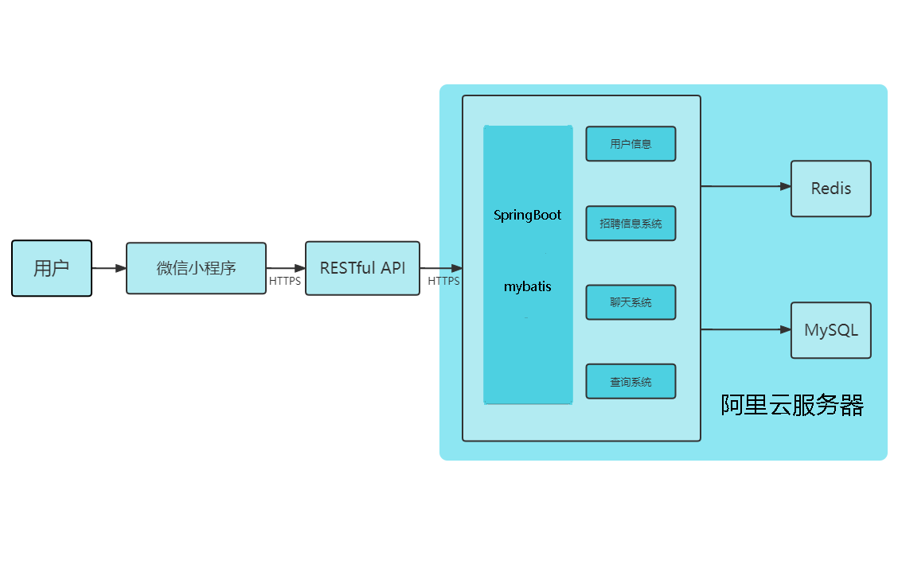

**语言：**

Java：选择Java作为后端编写语言。

作用：实现小程序后端的所需接口。

**前后端独立开发：**

APIFox：前期开发利用APIFox进行数据校验，此时前后端可分离工作，彼此进度不会互相影响。后端完成后还可以利用APIFox进行前后端联调。

作用：前后端分离，又能进行前后端连接。

**代码管理：**

1、github：作为代码管理的工具。

作用：能够进行代码版本管理，提高了代码的可用性。

### 模块功能及实现

后端按功能分为三个模块：**个人信息管理、招聘信息管理、聊天信息管理**。

#### 个人信息管理

我们需要对授权小程序的用户信息进行记录，用户第一次授权的时候应该将用户信息插入数据库，用户查询和更新个人信息的时候也应该需要相应的接口进行管理。

我们还需要对用户的简历信息进行管理，因此还需要用户的简历插入、更新和查询的操作，需要相应的接口进行管理。

#### 招聘信息管理

我们小程序的主要功能是帮助用户进行应聘与招聘，因此我们需要对工作进行查询、插入和更新，我们需要按照多种分类对工作进行不同查询。

对于用户的投递工作我们也需要记录，查询用户投递的工作查看是否通过招录。

用户需要收藏和查看浏览过的工作，对于这些我们也应该记录。

#### 聊天信息管理

由于我们的小程序有关于用户之间的交互，因此我们需要对用户之间的交互进行记录，比如聊天信息。

对于面试和招聘的消息列表，我们分开来存放，因此需要两个表。

# 四、API设计 [胡振宇]

前后端采用RESTful进行交互，因此我们查找使用GET，插入使用POST，更新使用PUT，删除使用DELETE。

API分为三个模块，分别是个人信息管理(用来管理用户)、招聘信息管理(用来管理工作以及招聘投递)、聊天信息管理(用来进行用户之间的聊天管理)。

### APIfox的使用

我们可以修改接口的访问路径、名称、使用的方法

如下的接口路径为：/user/getUser

使用的方法：GET

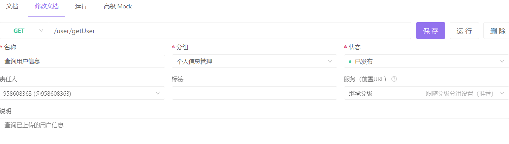

设置请求参数

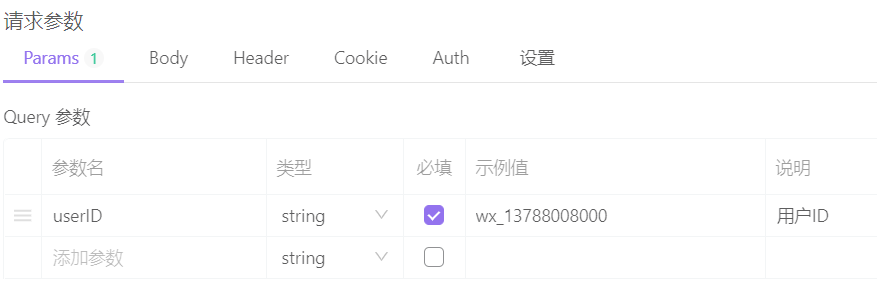

设置返回的参数

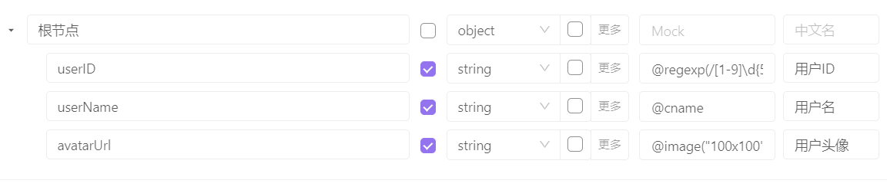

完成后可以设置响应的示例

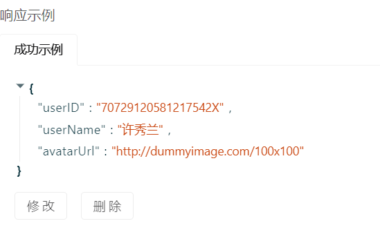

查询的时候添加参数，查询用户

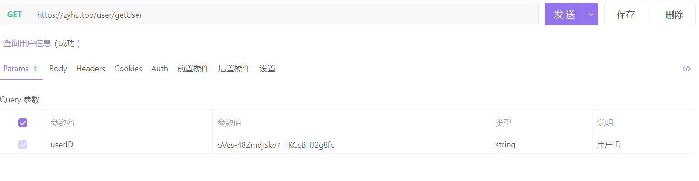

查看返回的值

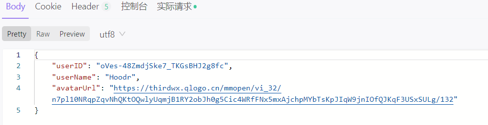

此处以查询用户接口为例，说明APIFox的使用与测试，详细的接口文档位于`API接口`文件夹中

# 五、数据库设计 [胡振宇]

## 所需数据

我们招聘小程序需要的数据有：工作的具体内容、用户的信息、用户的简历信息、用户的面试消息列表、用户的投递消息列表、用户投递过的消息列表、用户收藏的工作列表、用户浏览过的工作的历史记录列表、用户之间聊天的消息

以上数据均为数据库中需要持久保存的数据；不需要持久保存，但是需要频繁访问的数据包括重复查询的数据，如：每个用户进入小程序需要查询的附近工作内容。

由于我们的小程序需要持久化保存数据同时也需要缓存数据，因此我们使用MySQL和Redis作为数据库。

## ER图、数据表字段

根据要实现的功能我们设计数据库ER图如下：


### 表中具体字段意义如下：

#### 用户表：user

| 字段名    | 数据类型   | 用途               | 备注                |
| --------- | ---------- | ------------------ | ------------------- |
| userID    | Char(255)  | 微信小程序的用户ID | 主键,用户唯一标识符 |
| userName  | Char(255)  | 用户名             | 非空                |
| avatarUrl | Char(2000) | 头像               | 非空                |

#### 简历表：resume

| 字段名       | 数据类型  | 用途         | 备注 |
| ------------ | :-------- | ------------ | ---- |
| userID       | Char(255) | 用户ID       | 主键 |
| realName     | Char(255) | 真实名字     | 非空 |
| birthYear    | Char(255) | 生日         |      |
| education    | Char(255) | 最高学历     | 非空 |
| workYear     | Char(255) | 具体地址     |      |
| intentionJob | Char(255) | 目标工作     |      |
| privacy      | int(1)    | 是否对外可见 | 非空 |
| phoneNum     | Char(11)  | 手机号       | 非空 |

#### 招聘的消息列表：messagerecruit

| 字段名            | 数据类型  | 用途             | 备注 |
| ----------------- | :-------- | ---------------- | ---- |
| ID                | int(11)   | 招聘列表ID       | 主键 |
| userID            | Char(255) | 用户ID           | 非空 |
| otherID           | Char(255) | 另一用户ID       | 非空 |
| otherAvatarUrl    | Char(255) | 另一用户头像     | 非空 |
| otherUserName     | Char(255) | 另一用户名       | 非空 |
| latestMessage     | Char(255) | 最后一条消息内容 |      |
| latestMessageTime | datetime  | 最后一条消息时间 | 非空 |

#### 申请的消息列表：messageapply

| 字段名            | 数据类型  | 用途             | 备注 |
| ----------------- | :-------- | ---------------- | ---- |
| ID                | int(11)   | 招聘列表ID       | 主键 |
| userID            | Char(255) | 用户ID           | 非空 |
| otherID           | Char(255) | 另一用户ID       | 非空 |
| otherAvatarUrl    | Char(255) | 另一用户头像     | 非空 |
| otherUserName     | Char(255) | 另一用户名       | 非空 |
| latestMessage     | Char(255) | 最后一条消息内容 |      |
| latestMessageTime | datetime  | 最后一条消息时间 | 非空 |

#### 工作表：job

| 字段名           | 数据类型   | 用途           | 备注 |
| ---------------- | :--------- | -------------- | ---- |
| jobID            | int(11)    | 招聘列表ID     | 主键 |
| recruitPosition  | Char(255)  | 招聘职位       | 非空 |
| jobTitle         | Char(255)  | 工作标题       |      |
| maxWages         | int(11)    | 工资区间高     | 非空 |
| minWages         | int(11)    | 工资区间低     | 非空 |
| region           | Char(255)  | 工作区域       | 非空 |
| specificLocation | Char(255)  | 工作具体的地址 | 非空 |
| corporateName    | Char(255)  | 公司名         | 非空 |
| minEducation     | Char(255)  | 学历要求       | 非空 |
| mode             | Char(255)  | 工作是否全职   | 非空 |
| userID           | Char(255)  | 发布用户的ID   | 非空 |
| jobDescription   | Char(7500) | 工作描述       |      |
| recruitNum       | int(11)    | 招聘人数       | 非空 |
| createTime       | datetime   | 创建工作的时间 | 非空 |

#### 投递表：deliver

| 字段名     | 数据类型  | 用途         | 备注 |
| ---------- | :-------- | ------------ | ---- |
| ID         | int(11)   | 投递表ID     | 主键 |
| userID     | Char(255) | 用户ID       | 非空 |
| jobID      | int(11)   | 工作ID       | 非空 |
| isAgree    | int(1)    | 是否接受投递 | 非空 |
| createTime | datetime  | 投递时间     | 非空 |

#### 收藏的工作表：collectedjob  

| 字段名     | 数据类型  | 用途     | 备注 |
| ---------- | :-------- | -------- | ---- |
| ID         | int(11)   | 收藏表ID | 主键 |
| userID     | Char(255) | 用户ID   | 非空 |
| jobID      | int(11)   | 工作ID   | 非空 |
| createTime | datetime  | 收藏时间 | 非空 |

#### 聊天消息表：chatmessage

| 字段名      | 数据类型   | 用途         | 备注 |
| ----------- | :--------- | ------------ | ---- |
| ID          | int(11)    | 聊天表ID     | 主键 |
| userID      | Char(255)  | 用户ID       | 非空 |
| otherUserID | Char(255)  | 用户ID       | 非空 |
| speaker     | datetime   | 聊天时间     | 非空 |
| contentType | Char(255)  | 消息的类型   | 非空 |
| content     | Char(2550) | 发送的消息   | 非空 |
| createTime  | datetime   | 聊天消息时间 | 非空 |

#### 浏览历史表：browed

| 字段名     | 数据类型  | 用途         | 备注 |
| ---------- | :-------- | ------------ | ---- |
| ID         | int(11)   | 浏览历史表ID | 主键 |
| userID     | Char(255) | 用户ID       | 非空 |
| jobID      | int(11)   | 工作ID       | 非空 |
| createTime | datetime  | 浏览时间     | 非空 |

## 数据库技术：

后端连接数据库使用的是mybatis，mybatis是一种半ORM技术。

对象关系映射（Object Relational Mapping，简称ORM）模式是一种为了解决面向对象与关系数据库存在的互不匹配的现象的技术。Mybatis是将java方法与sql语句关联起来，而没有将java对象与数据库关联起来，因此算是半ORM。

mybatis的使用方法为：

1.加入mybatis的依赖

2.通过接口，定义操作数据库的方法

3.创建xml文件，作为SQL映射文件

4.编写自己的SQL语句

# 六、微信小程序端的实现 [冯子豪]

我将就业帮的前端分为四大模块，分别是**用户管理、消息聊天、岗位招聘、信息发布**，分别来描述具体的实现。

### **用户管理**

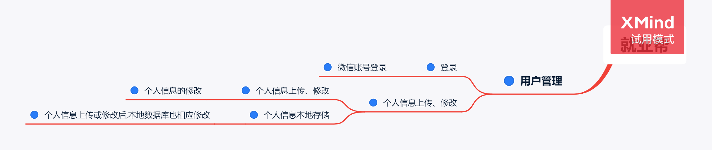

这块的页面静态搭建只需按照原型设计来设计就行，没有什么特别的地方。简历页面利用到了vant-weapp的表单项和选择器。

#### 登录

这里分为两个部分，一部分是获取用户的基本信息(不包括唯一标识符openID)，另一部分是获取唯一标识符openID。

第一部分：通过调用wx官方的api接口wx.getUserProfile()即可顺利获得用户的基本的微信信息(头像、城市、性别、语言、昵称、省份信息)。

第二部分：由于是唯一标识符，获取的难度要大于基本的信息，需要 官方api接口wx.login()，配合appID和secret(需去微信公众平台获取)，就可以获取到用户的openID了。

#### 个人信息上传

这里的个人信息分为两个部分，一个是微信的基本信息，另一个是简历的基本信息。

两部分的信息，我都通过wx.setStorageSync()进行了本地的存储，并且通过接口POST上传用户信息和简历信息，来完成本地和云端的双存储。

#### **微信图片路径的获取**

 利用wx.chooseImage()设置完参数后，选择图片后，通过res.tempFilePaths[0]来获取图片的路径。


### 消息聊天

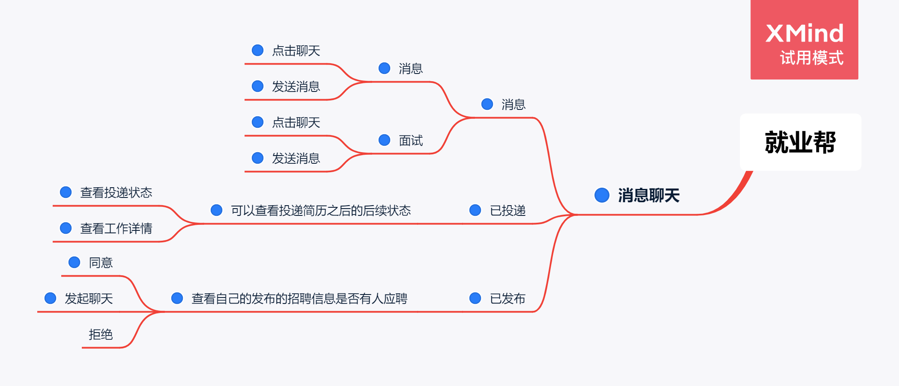

消息列表我利用标签消息和面试，通过点击来展示两方面的信息。通过在wxml文件中设置wx:if‘’{{条件}}‘’来实现页面的多用和点击之后样式的变化。聊天页面的设计参考了《参考文献》中的‘’聊天页面‘’。其他页面的设计都没有什么难点。

#### 消息

分为消息和面试两个板块。其中消息板块是面对应聘者创建的，而面试板块是面对发布者创建的。你申请的工作，聊天列表会出现在消息页，而对方会出现在面试页。且每发送一条新的消息，列表会更新，来显示最后一条消息。这里利用了两个后端接口请求 ，一个是获取应聘列表信息，另一个是获取面试列表信息。

#### 已投递|已发布详情

应聘者看了工作详情或者聊了之后若是满意这份工作可以，点击申请，发送POST请求，这时应聘者会在已投递页面中出现一条投递信息，包括工作的信息和投递状态(待录取、成功、失败)三个状态。同时在这份工作的发布者的已发布详情中会出现应聘者的姓名等信息，并有三个选项(聊天、拒绝、接受)。发布者选择一个同意或者拒绝，发送相应的POST请求，应聘者可以在已投递的状态中查看到。

   例如：这是上传投递信息的一个接口的主要部分。

await upload('/recruit/createDelivered',{jobID:jobList.job.jobID,userID:openId,userName:userInfo.nickName})

#### 已投递详情

可以快速查看该工作的详情，并进入聊天页面。

#### 聊天

通过页面跳转来转递对方的userID，例如：

wx.navigateTo({

​     url: '/pages/jobChat/jobChat?otherID=' + otherID

​    })，

通过聊天记录列表的speak属性(为说话者的ID)，通过在wx:if"{{speak==ID}}"来实现这段消息出现在左边还是右边，来呈现出不同的气泡颜色等的效果。通过contentType:'text|image'来区分是否是图片，若是图片显示图片，并提供showPic: function (event)功能来预览图片。并且在发送一条消息的同时，不仅POST聊天记录，也同时POST面试和应聘列表完成最后一条消息的更新。


### 岗位招聘

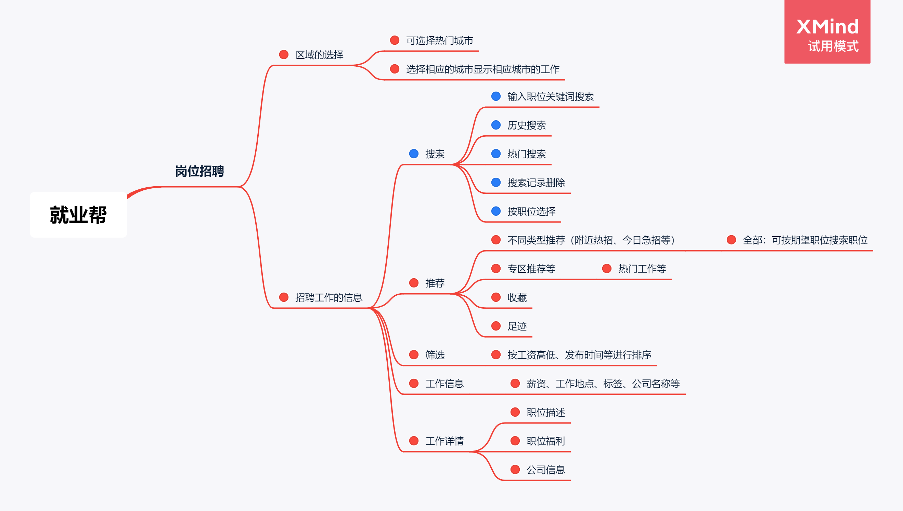

岗位招聘包含十几个类似的页面，通过不同的接口请求来区分不同的页面，但页面的样式是一致的，这部分的制作工作量较大。

#### 区域的选择

通过选择已有的杭州地区，如西湖区、拱墅区等，点击相应的区，会调用wx.setStorageSync()进行本地存储，通过wx.reLaunch()来跳转到职位页。并调用相关接口显示该地区的工作。

#### 搜索

包括了历史搜索，历史搜索通过点击搜索之后，将输入框的内容存储通过

if(historyList.length>7){

​     if(value.length>0){

​      if(historyList.indexOf(value) !== -1){

​       historyList.splice(historyList.indexOf(value), 1)

​      }

​      historyList.splice(7,1)

​      historyList.unshift(value)

​      this.setData({

​        historyList

​      })

​      wx.setStorageSync('searchHistory', historyList)

​     }在本地的历史记录列表searchHistory中，且最多只能存储8条消息，并且若该内容列表已有，且不是在第一个，会将这条记录放到第一。

热门搜索，是我人工设置的静态的数据。

点击搜索，通过页面传递搜索关键词，

wx.navigateTo({

​     url: '/pages/PositionAbout/searchDetail/searchDetail?jobKeyWord=' + value

​    })

调用接口来获取相关的搜索结果。

#### 推荐工作

通过多种多样的接口来获取多种多样的工作列表，来显示。例如：

// 获取附近急招——接口

  async getJobList(){

   let place = wx.getStorageSync('currentPlace')

​    let jobList = await request('/recruit/getHotJob',{region:place})

​    this.setData({

​     jobList: jobList

​    })

   },

来获取你所选的地区的工作。

#### 工作详情

这部分显示了多种多样的工作的各种信息，只需将页面搭建好，将获取到的工作信息动态显示。

#### 收藏

点击工作详情中五角星，即可点亮，并且调用POST收藏接口完成收藏，可在后面我的收藏中查看。

  async collect(){

   let openId = wx.getStorageSync('openId')

   let jobList = this.data.jobDetailList

   await upload('/recruit/createCollect',{userID:openId,jobID:jobList.job.jobID})

  },

足迹类似。

#### 足迹

每次进入一个工作详情就调用POST足迹接口来完成足迹的记录，可在后面我的足迹中查看。


### 信息发布

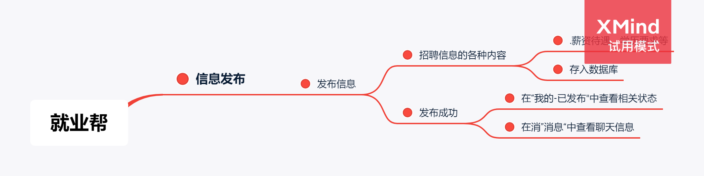

页面设计主要利用大量的vant-weapp表单项

发布信息：

主要通过获取相应的表单项的内容，通过调用接口：

  await upload('/recruit/createJob',{recruitPosition:value_position,jobTitle:value_title,maxWages:value_highsalary,minWages:value_lowsalary,region:value_region,specificLocation:value_place,corporateName:value_corporateName,minEducation:value_education,mode:value_mode,userID:openId,publisherName:userInfo.nickName,publisherAvatarUrl:userInfo.avatarUrl,jobDescription:value_description,recruitNum:value_number,welfare1:value_welfare1,welfare2:value_welfare2,welfare3:value_welfare3,welfare4:value_welfare4,welfare5:value_welfare5,label1:value_label1,label2:value_label2,label3:value_label3})

很繁琐，将信息上传至云端。

# 七、后端的实现[胡振宇]

前后端采用RESTful进行交互，因此我们查找使用GET，插入使用POST，更新使用PUT，删除使用DELETE。

## 7.1 用户管理的实现

用户管理需要对用户进行添加、更新和查找的操作。

首先建立一个用户类文件，包含数据库中所有的用户表字段。

controller层中创建一个Java文件，里面添加接收信息的方法，用于处理收到的请求

首先添加注解，用于SpringBoot扫描，获取指定的方法传递指定的参数，并添加返回的方法。

然后添加调用service的方法调用，返回user的json数据。

```Java
@ResponseBody
@RequestMapping(value= {"/getUser"}, method={RequestMethod.GET})
public User GetUser(@RequestParam("userID") String id) {
    return userService.Select(id);
}
```

service层中创建一个Java文件，里面添加具体处理的方法

方法开始先查询Redis是否有该用户的数据缓存，若有，直接返回

若没查到，则查询数据库，将数据库查询到的数据添加到缓存中，返回用户类

```Java
public User Select(String id) {
    User user=(User) redisUtil.get(RedisConstant.USER_KEY +id);
    if(user==null){
        user=userMapper.Select(id);
        redisUtil.set(RedisConstant.USER_KEY+id,user);
    }
    return user;
}
```

mapper层添加service中需要用到的方法，作为接口

```Java
@Service
@Mapper
public interface UserMapper {
    int Insert(User params);
    int Update(User params);
    User Select(String userID);
}
```

## 7.2 工作管理的实现

工作管理需要对工作进行添加、更新和查找的操作。

首先建立一个工作类文件，包含数据库中所有的工作表字段。

controller层中创建一个Java文件，里面添加接收信息的方法，用于处理收到的请求

首先添加注解，用于SpringBoot扫描，获取指定的方法传递指定的参数，并添加返回的方法。

然后添加调用service的方法调用，返回JobSpecific的json数据。

```Java
@ResponseBody
@RequestMapping(value= {"/getSpecificJobOfUser"}, method={RequestMethod.GET})
public JobSpecific GetSpecificJob(@RequestParam("userID") String userID,
                                  @RequestParam("JobID") Integer JobID) {
Job job=jobService.Select(JobID);
JobSpecific jobSpecific=new JobSpecific();
jobSpecific.job=job;
jobSpecific.isCollect=collectedJobService.SelectSpecific(userID, JobID)!=null;
    return jobSpecific;
}
```

service层中创建一个Java文件，里面添加具体处理的方法

方法开始先查询Redis是否有该用户的数据缓存，若有，直接返回

若没查到，则查询数据库，将数据库查询到的数据添加到缓存中，返回工作类

```Java
public Job Select(int jobID) {
    Job job=(Job) redisUtil.get(RedisConstant.JOB_KEY+jobID);
    if(job==null){
        job=jobMapper.Select(jobID);
        redisUtil.set(RedisConstant.JOB_KEY+jobID,job);
    }
    return job;
}
```

mapper层添加service中需要用到的方法，作为接口

```Java
@Service
@Mapper
public interface JobMapper {
    int Insert(Job params);
    int Update(Job params);
    List<Job> SelectAll();
    List<Job> SelectRegion(String region);
    List<Job> SelectIncludeKey(String key);
    List<Job> SelectHighPay();
    List<Job> SelectSend(String userID);
    Job Select(int jobID);
}
@Service
@Mapper
public interface UserMapper {
    int Insert(User params);
    int Update(User params);
    User Select(String userID);
}
```

## 7.3 投递管理的实现

投递管理需要对用户的投递进行添加、更新和查找的操作。

首先建立一个投递类文件，包含数据库中所有的投递表字段。

controller层中创建一个Java文件，里面添加接收信息的方法，用于处理收到的请求。

首先添加注解，用于SpringBoot扫描，获取指定的方法传递指定的参数，并添加返回的方法。

查找投递了此工作ID的用户ID，返回投递类，设置接受投递。

然后添加调用service的更新的方法调用，返回布尔数据。

```Java
@ResponseBody
@RequestMapping(value= {"/agreeDeliver"}, method={RequestMethod.PUT})
public boolean AgreeDeliver(@RequestParam("jobID") Integer jobID,
                            @RequestParam("userID") String userID) {
    Deliver deliver = deliverService.SelectOne(userID,jobID);
    deliver.setIsAgree(1);
    return deliverService.Update(deliver);
}
```

service层中创建一个Java文件，里面添加具体处理的方法

方法开始先删除Redis投递记录的数据缓存

更新投递记录，并用try{}catch捕获错误。

```Java
public Boolean Update(Deliver params) {
    redisUtil.del(RedisConstant.DELIVER_KEY+params.getUserID());
    redisUtil.del(RedisConstant.DELIVER_KEY+"job"+params.getJobID());
    try{
        deliverMapper.Update(params);
    }
    catch (Exception e){
        e.printStackTrace();
        return false;
    }
    return true;
}
```

mapper层添加service中需要用到的方法，作为接口

```Java
@Service
@Mapper
public interface DeliverMapper {
    int Insert(Deliver params);
    int Update(Deliver params);
    Deliver SelectOne(String userID,Integer jobID);
    List<Deliver> Select(String id);
    List<Deliver> SelectUser(Integer jobID);
}
```

## 7.4 消息管理的实现

聊天管理需要对聊天进行添加、更新和查找的操作。

首先建立一个聊天类文件，包含数据库中所有的聊天表字段。

controller层中创建一个Java文件，里面添加接收信息的方法，用于处理收到的请求。

首先添加注解，用于SpringBoot扫描，获取指定的方法传递指定的参数。

创建聊天消息对象，将获取的参数传递到对象中。

然后添加调用service的方法调用，返回布尔数据。

```Java
@ResponseBody
@RequestMapping(value= {"/createChat"}, method={RequestMethod.POST})
public boolean PostChatMessage(@RequestParam("userID") String userID,
                                @RequestParam("otherID") String otherID,
                                @RequestParam("avatarUrl") String avatarUrl,
                                @RequestParam("otherAvatarUrl") String otherAvatarUrl,
                                @RequestParam("userName") String userName,
                                @RequestParam("otherUserName") String otherUserName,
                                @RequestParam("speaker") String speaker,
                                @RequestParam("contentType") String contentType,
                                @RequestParam("content") String content) {
        ChatMessage chatMessage = new ChatMessage();
        chatMessage.setUserID(userID);
        chatMessage.setOtherID(otherID);
        chatMessage.setOtherUserName(otherUserName);
        chatMessage.setOtherAvatarUrl(otherAvatarUrl);
        chatMessage.setSpeaker(speaker);
        chatMessage.setContentType(contentType);
        chatMessage.setContent(content);
        messageApplyService.UpdateByChat(userID, otherID, otherAvatarUrl, otherUserName, content);
        messageRecruitService.UpdateByChat(userID, otherID, otherAvatarUrl, otherUserName, content);
        return chatMessageService.Insert(chatMessage)&&PostChatMessage(chatMessage,avatarUrl,userName);
    }
```

service层中创建一个Java文件，里面添加具体处理的方法

方法开始先删除Redis投递记录的数据缓存

插入投递记录，并用try{}catch捕获错误。

```Java
public Boolean Insert(ChatMessage params) {
        redisUtil.del(RedisConstant.CHAT_KEY+params.getUserID()+params.getOtherID());
        try{
            chatMessageMapper.Insert(params);
        }
        catch (Exception e){
            e.printStackTrace();
            return false;
        }
        return true;
    }
```

mapper层添加service中需要用到的方法，作为接口

```Java
@Service
@Mapper
public interface ChatMessageMapper {
    int Insert(ChatMessage params);
    int Update(ChatMessage params);
    List<ChatMessage> Select(String userID,String otherID);
}
```

# 八、系统测试[胡振宇]

## 8.1 单元测试

我使用的是SpringBoot，因此后端单元测试使用junit进行单元测试。

我的单元测试是对service层进行测试，因为service层是主要的功能处理层，对service层进行测试可以涉及到具体的功能处理，且大部分与数据库进行交互的模块也会被测试到。

其中对于service层的测试具体如下(以用户管理测试为例)：

首先添加junit注解，代表接下来的函数在执行junit时会被执行到

先新建一个用户对象，设置用户对象的属性

插入用户并将返回的值进行比较，看是否符合预期

修改用户的属性，更新用户并将返回值进行比较，看是否符合预期

查询数据库中该用户的值，并将查询到的用户同该用户进行比较，看是否相同

```Java
@Test
void UserTest() {
    User user=new User();
    user.setUserID("deliver1");
    user.setUserName("张铁林");
    assertEquals(false,userService.Insert(user));
    user.setUserName("王安");
    assertEquals(true,userService.Update(user));
    user.setUserName("张铁林");
    assertEquals(true,userService.Update(user));
    assertEquals(user,userService.Select("deliver1"));
}
```

以下为使用单元测试覆盖率的插件jacoco后测试生成的单元测试覆盖率表格

| CLASS                 | INSTRUCTION_MISSED | INSTRUCTION_COVERED | BRANCH_MISSED | BRANCH_COVERED | LINE_MISSED | LINE_COVERED | COMPLEXITY_MISSED | COMPLEXITY_COVERED | METHOD_MISSED | METHOD_COVERED |
| --------------------- | ------------------ | ------------------- | ------------- | -------------- | ----------- | ------------ | ----------------- | ------------------ | ------------- | -------------- |
| JobService            | 11                 | 169                 | 0             | 2              | 6           | 37           | 2                 | 9                  | 0             | 10             |
| ChatMessageService    | 7                  | 133                 | 0             | 2              | 0           | 24           | 1                 | 4                  | 0             | 4              |
| BrowsedService        | 27                 | 179                 | 1             | 5              | 5           | 34           | 1                 | 8                  | 0             | 6              |
| ResumeService         | 8                  | 103                 | 0             | 2              | 3           | 20           | 0                 | 5                  | 0             | 4              |
| MessageApplyService   | 2                  | 207                 | 0             | 4              | 0           | 40           | 1                 | 8                  | 1             | 6              |
| DeliverService        | 11                 | 202                 | 0             | 4              | 6           | 26           | 1                 | 7                  | 0             | 6              |
| CollectedJobService   | 27                 | 179                 | 1             | 5              | 5           | 34           | 1                 | 8                  | 0             | 6              |
| MessageRecruitService | 2                  | 207                 | 0             | 4              | 0           | 40           | 1                 | 8                  | 1             | 6              |
| UserService           | 8                  | 103                 | 0             | 2              | 3           | 20           | 0                 | 5                  | 0             | 4              |

## 8.2 测试部署及结果

测试部署在action上自动执行

在.github/workflows中添加junit.yml

在junit.yml中

name:  此 workflow 的名称，可任意取，到时会出现在 Github Actions 中

on: [push, pull_request]
on 是控制何时要执行这个 workflow

push: 有 commit push 时
pull_request: pull_request更新时
jobs:
  build: 
    runs-on: ubuntu-latest 
一个 workflow 可以有很多 jobs 组成，它们通常是同时 (平行) 执行的， 不过可以设定先后顺序。

steps:
step 是 Github Actions 的最小单位 steps 里每个 step 可以执行一或多个指令或一个 Action 要执行指令


我使用on: push上传到github，github会自动执行workflow中的内容

我的action测试结果如下

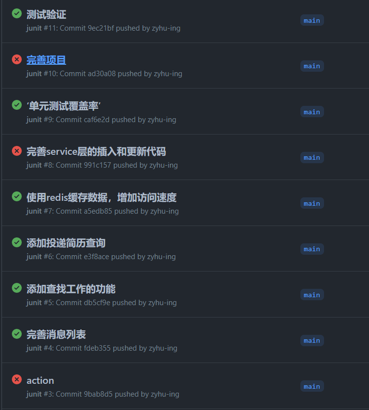


# 九、系统部署 [胡振宇]

小程序后端使用云平台进行部署

优点：可通过公网IPv4访问，可持续运行

具体步骤：

通过jar包方式启动，也就是使用spring boot内置的tomcat运行。

1.使用idea创建一个springboot工程，打包方式选择jar，完成业务功能后，点击maven里的package，打成jar包

2.将jar包上传到服务器，通过Java命令启动

# 十、功能展示 [冯子豪、胡振宇]

具体功能通过视频进行展示

视频位于：docs/演示视频

# 十一、清单 [冯子豪、胡振宇]

wechatApp为前端代码仓库，service为后端代码仓库，docs为文档仓库，团队地址为：https://github.com/Recruit-of-MI

- 前端代码: wechatApp
- 后端代码: service
- 项目成员分工：docs/选题演示/项目的具体功能及成员分工.md
- 原型设计文件: docs/原型设计/前端设计
- API接口：docs/API接口
- 项目演示视频: docs/演示视频
- 选题演示：docs/选题演示
- 中期验收：docs/中期演示
- 系统测试验收：docs/系统测试演示
- 期末验收：docs/期末成果演示
- 个人文档冯子豪：docs/1911060118冯子豪个人文档

# 十二、总结 [冯子豪、胡振宇]

冯子豪：

现在回顾一整个项目的开发过程，总体的感觉是井然有序。第一次验收时，由于我是负责前端的，所以我完成了项目的前端设计和分工。第二次验收，我完成了小程序前端页面的制作，并录制了页面展示视频。第三次的系统测试，我没有过多的参与。总体来说在老师的安排下和积累以往的经验下，我觉得这次的开发经历是我觉得最为顺利的一次。首先没有在页面的制作上遇到特别多的困难，困难更多的出现在集成上，我老是在测试时发现接口有些问题，叫我的搭档来改。现在我感觉我对项目的完整的一次开发有了更深的影响，对比第一次上安卓开发课程时的不知所措相比，这次的开发更像稳扎稳打，已经对每一步需要做什么有了更深的体会。由于我的搭档第一次也是我安卓开发的搭档，第一次合作我们有很多不适应，但是这次合作我们平时并没有太多的交流，但却都完成了各自的任务，只是在最后的集成环节上密切交流。我们都在老师的引导下学习到了很多，以至于这次的开发比较顺利。

下一步，我要学习后端的知识，我对api接口虽然不是很陌生，但也不能说很熟悉，所以我希望下一步我能在后端上花费一些精力，来学习后端的一些知识。

胡振宇：

本次项目我负责后端的大部分工作，在此之前我并未独立完成过后端，通过这次项目我更加深入理解了后端的项目搭建与运行，更加了解了接口的设计规范，知道了系统测试并使用action执行测试，系统的部署是项目能够跨计算机运行的关键。

总之，通过本次实验，我对项目的完整流程有了一个大概的方向，对于后端也产生了不小的兴趣，未来希望继续朝向后端的方向发展，需要更进一步学习后端的相关知识。

# 十二、参考文献 [冯子豪、胡振宇]

系统前端所参考的文献或者代码，比如：

- 聊天页面: https://blog.csdn.net/Crazydoubao/article/details/124828635
- vant-weapp: https://vant-contrib.gitee.io/vant-weapp/#/home
- iconfont：https://iconfont.cn/manage/index
- SpringBoot: https://spring.io/projects/spring-boot
- Redis: https://redis.io/docs/
- MyBatis: https://mybatis.org/mybatis-3/zh/index.html